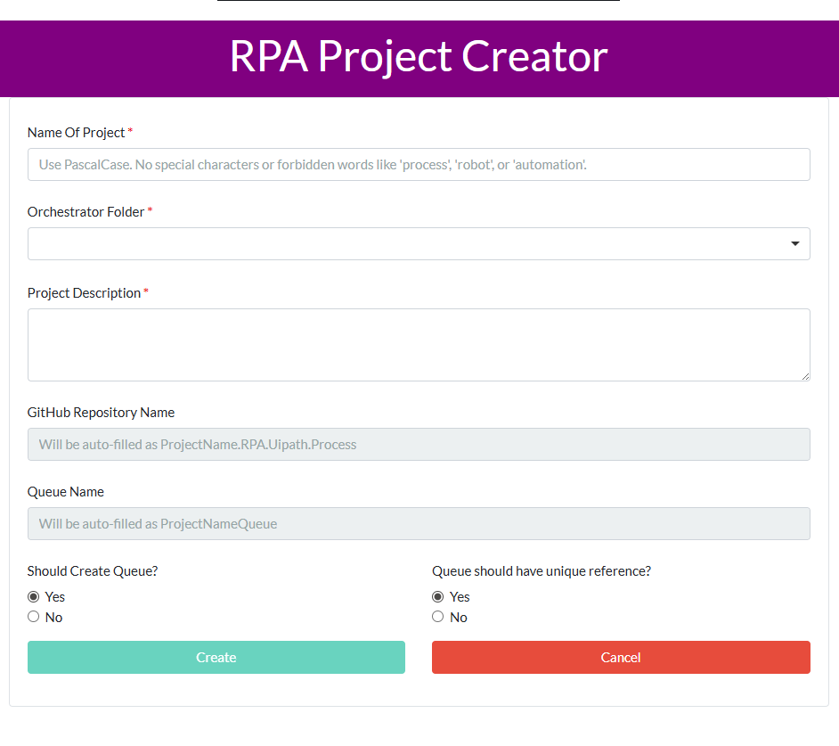

# ProjectCreator.RPA.Uipath.Process

An automated UiPath RPA process that creates standardized RPA projects with GitHub repository setup, Orchestrator queue creation, and project structure initialization.



## Overview

This process automates the creation of new RPA projects by:
- Collecting project details through a user-friendly form interface
- Setting up GitHub repositories with proper naming conventions
- Creating Orchestrator queues for transaction processing
- Generating project documentation using AI-powered content generation
- Establishing standardized folder structures and configurations

## Features

- **Interactive Form Interface**: User-friendly form for project input with validation
- **GitHub Integration**: Automated repository creation and setup
- **Orchestrator Integration**: Queue creation and folder management
- **AI-Powered Documentation**: Automatic README and description generation
- **Standardized Project Structure**: Consistent folder organization and naming
- **Configuration Management**: Excel-based configuration system
- **Error Handling**: Comprehensive error management and user feedback

## Packages and Dependencies

### UiPath Packages
- **UiPath.Excel.Activities** `[3.1.1]` - Excel file operations and data handling
- **UiPath.Form.Activities** `[25.4.3]` - Form creation and user interface components
- **UiPath.IntegrationService.Activities** `[1.15.0]` - Integration service activities including AI/ML capabilities
- **UiPath.System.Activities** `[25.6.1]` - Core system activities and utilities
- **UiPath.WebAPI.Activities** `[2.0.0-preview]` - Web API integration capabilities

### Project Configuration
- **Studio Version**: 25.0.172.0
- **Target Framework**: Windows
- **Expression Language**: VisualBasic
- **Runtime Options**: 
  - Auto-dispose: false
  - Pausable: true
  - Attended: false
  - Requires user interaction: true

## Configuration Assets (Data/Config.xlsx)

The process uses an Excel configuration file (`Data/Config.xlsx`) with the following key settings:

### Settings Sheet
- **RpaLocalRepositoryFolder**: Local path for RPA project storage
- **GithubOrganizationName**: GitHub organization name for repository creation
- **GithubUsername**: GitHub username for API authentication
- **GithubAccessToken**: Personal access token for GitHub API
- **GithubCreateRepoApiUri**: GitHub API endpoint for repository creation

## Process Workflow

### 1. Configuration Initialization (`InitializeConfig.xaml`)
- Loads configuration from `Data/Config.xlsx`
- Validates required settings and assets
- Prepares environment variables

### 2. User Input Collection (`GetProjectDetails.xaml`)
- Displays interactive form for project details
- Validates project name (PascalCase, no forbidden words)
- Collects orchestrator folder selection
- Gathers project description and queue preferences

### 3. Project Repository Setup (`InstantiateAndSetupProjectRepo.xaml`)
- Creates local project folder structure
- Generates project documentation using AI
- Sets up initial project files and configurations

### 4. Queue Creation (`CreateQueueIfNotExisting.xaml`)
- Creates Orchestrator queue if requested
- Configures queue properties and unique reference settings
- Links queue to project for transaction processing

### 5. GitHub Repository Setup (`SetupGithubRepository.xaml`)
- Creates GitHub repository via API
- Initializes local git repository
- Pushes project files to remote repository

### 6. Configuration Updates (`UpdateConfigurationFile.xaml`)
- Updates project-specific configuration files
- Sets up environment-specific settings
- Configures connection strings and parameters

## Form Interface Details

### Input Fields
- **Project Name**: PascalCase validation, no special characters or forbidden words
- **Orchestrator Folder**: Dropdown selection from available folders
- **Project Description**: Multi-line text area for process description
- **GitHub Repository Name**: Auto-generated as `ProjectName.RPA.Uipath.Process`
- **Queue Name**: Auto-generated as `ProjectNameQueue`
- **Queue Creation Options**: Radio buttons for queue creation and unique reference settings

### Validation Rules
- Project names must start with capital letter
- Only letters, numbers, and spaces allowed
- Forbidden words: 'robot', 'automation', 'process', 'queue', 'asset', 'orchestrator', 'tenant'
- Must not conflict with existing processes

## AI Integration

The process uses UiPath Integration Service for AI-powered content generation:

### AI Prompts
- **Description Generation** (`PromptToGenerateDescription.txt`): Creates concise repository descriptions
- **README Generation** (`PromptToGenerateReadme.txt`): Generates step-by-step process documentation
- **PascalCase Validation** (`PromptToValidatePascalCase.txt`): Validates naming conventions

## Expected Assets and Resources

For each created project, the process expects:
- **Credential Asset**: `{ProjectName}_SampleAppLoginCredential`
- **Storage Bucket**: `{ProjectName}Bucket`
- **Orchestrator Queue**: `{ProjectName}Queue` (if enabled)

## Project Structure

Created projects follow this standardized structure:
```
ProjectName/
├── Data/
│   └── Config.xlsx
├── Documentation/
├── Framework/
├── Main.xaml
├── project.json
├── README.md
├── Reusable_Components/
└── Tests/
```

## Getting Started

### Prerequisites
- UiPath Studio 25.0.172.0 or later
- Access to UiPath Orchestrator
- GitHub account with personal access token
- Excel file with proper configuration settings

### Setup Instructions
1. Clone this repository
2. Open the project in UiPath Studio
3. Configure `Data/Config.xlsx` with your settings:
   - GitHub credentials and organization
   - Local repository folder path
   - Orchestrator connection details
4. Ensure all required assets are available in Orchestrator
5. Run the process from Studio or publish to Orchestrator

### Configuration Requirements
- Valid GitHub personal access token with repo creation permissions
- Access to UiPath Orchestrator with folder management permissions
- Local folder path with write permissions
- Excel file with proper formatting and required fields

## Usage


## Error Handling

The process includes comprehensive error handling:
- Form validation with real-time feedback
- Configuration validation before execution
- API error handling for GitHub and Orchestrator operations
- User-friendly error messages and recovery options
- Automatic cleanup on failure

## License

See `LICENSE` for details.

## Support

For issues or questions:
1. Check the configuration settings in `Data/Config.xlsx`
2. Verify GitHub and Orchestrator permissions
3. Review the job response messages for specific error details
4. Ensure all required assets are properly configured